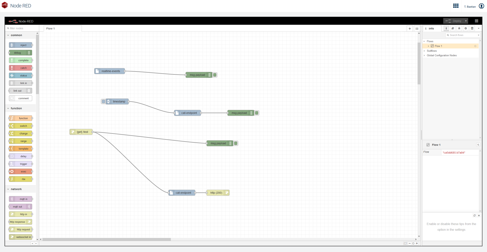

# Cumulocity - Node-RED

This repository contains the required parts to run Node-RED within a Cumulocity tenant.

The repository is splitted into two parts ([backend](backend/README.md) and [frontend](frontend/README)).
The backend folder contains all the required bits to run Node-RED as a microservice within Cumulocity.
The frontend folder contains an optional [Cumulocity WebSDK](https://cumulocity.com/guides/web/angular/) based angular app, which has been created to serve the Node-RED frontend (hosted in the microservice) within an iframe.

## Setup

1. Upload and subscribe the node-red microservice on your tenant.
2. The microservice introduces new permissions, make sure you've assigned these to a global role of your user.
3. Upload the node red blueprint on your tenant if it was not automatically available in the `Extensions` of your tenant.
4. Deploy the uploaded node-red blueprint on your tenant.

## Login

Versions >= 1.0.4 of the frontend application are again able to authenticate against Cumulocity via Basic Auth and OAuth, with OAuth actually being the prefered way. To be able to use OAuth for authentification we have to disable the XSRF-Token validation of Cumulocity for the tenant. Please check on your own if this might be a security concern for you: [Cross-site request forgery](https://en.wikipedia.org/wiki/Cross-site_request_forgery). The application will ask if it should disable the XSRF-Token validation for you, if that should be required.

## TODOs
- Currently the microservice uses the `PER_TENANT` isolation level. In future I might want to think about solutions to let this microservice run with `MULTI_TENANT` isolation level, so a single microservice instance can be used by multiple tenants to save costs.
- Create more nodes for simpler integration of Cumulocity.
- ~~Look for solution to handle the basic auth popup when the application is opened initially. This does not happen on tenants which use the CookieAuth strategy (OAuth).~~ ~~As of Cumulocity version 10.7.0.4 we are no longer capable to use OAuth for logging in. You can still choose OAuth as the login strategy, but make sure to not set the "Enforce OAuth Internal" option if you would like to use Node-RED.~~ 
As of Cumulocity version > 1011.0.4 we are again able to authenticate against Cumulocity using Cookies (for e.g. OAuth login strategy) this requires to disable XSRF-Token validation. The application will prompt if it should disable this, in case it is required. NOTE: Please check on your own if it a security concern for you to disable [XSRF-Token validation](https://en.wikipedia.org/wiki/Cross-site_request_forgery).
- ~~Better handling on encrypting credentials that have been used within Node-RED flows.~~ Credentials are now stored within an encrypted tenant option.

------------------------------

This tools are provided as-is and without warranty or support. They do not constitute part of the Cumulocity product suite. Users are free to use, fork and modify them, subject to the license agreement. While Cumulocity welcomes contributions, we cannot guarantee to include every contribution in the master project.
_____________________
For more information you can Ask a Question in the [TECHcommunity Forums](https://techcommunity.cumulocity.com/).
